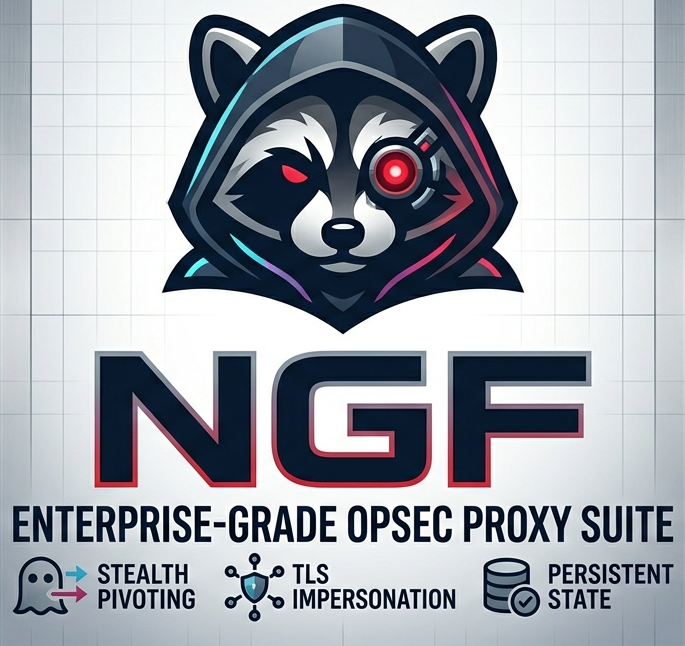

<h1 align="center">Next-Generation-Fetch</h1>

  <strong>An enterprise-grade, OpSec-aware proxy harvesting and validation suite</strong> 
  designed for security professionals, red teamers, and researchers.

  

---

> [!WARNING]
> This repository is built around `NGF` - [Next-Generation-Fetch Core](https://github.com/J4ck3LSyN-Gen2/NGF).  
> You must have NGF installed to use the harvested proxy databases.

## How-To-Use

1. Either `git clone` the entire repo, or I recommend pulling which ever index you wish via `wget` and work from there.
2. Un-tar the archive `tar -xzf <archive.tar.gz`
3. Pass into NGF `python3 ngfXXX.py --db-import <whatever-the-name>.json` and enjoy.
